These dogs have, each in their own way, shaped my sense of care, patience, and presence.

## Cody Sherpa

  Cody was our family's chihuahua mix and my childhood pet. We adopted him in 2012, and we got to spend nearly 13 years with him. We also have another family dog named Daisy.

  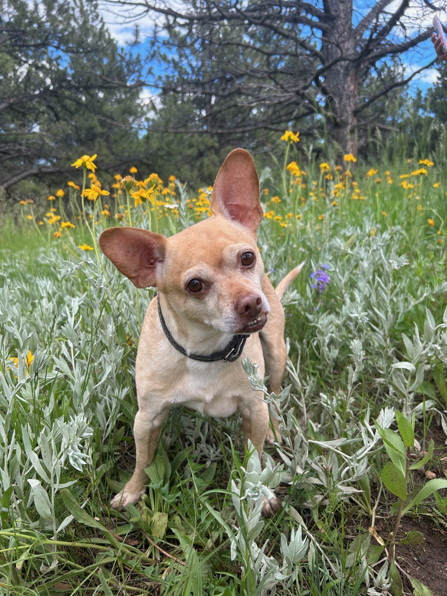
  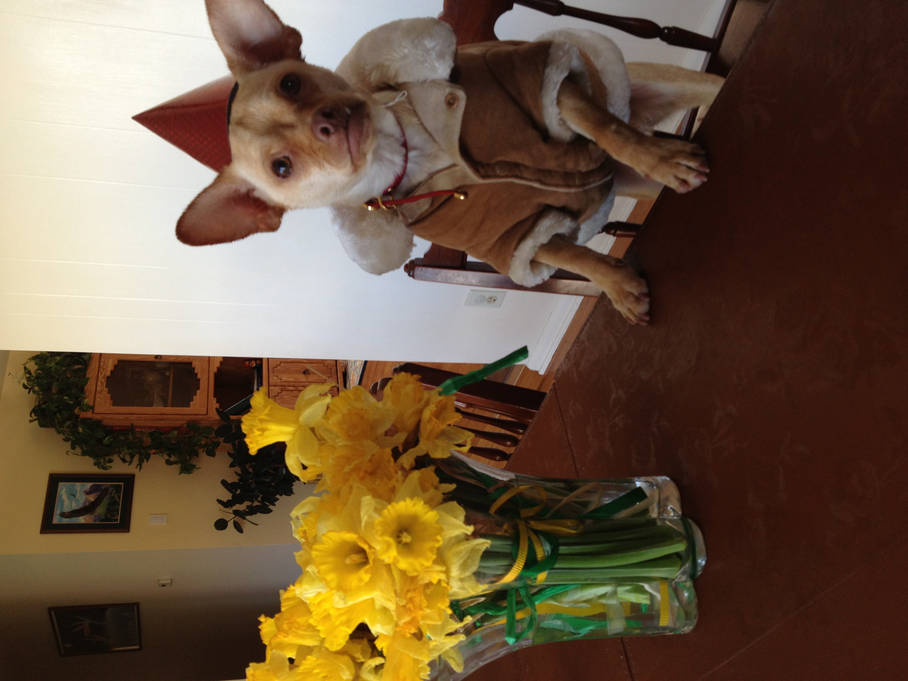
  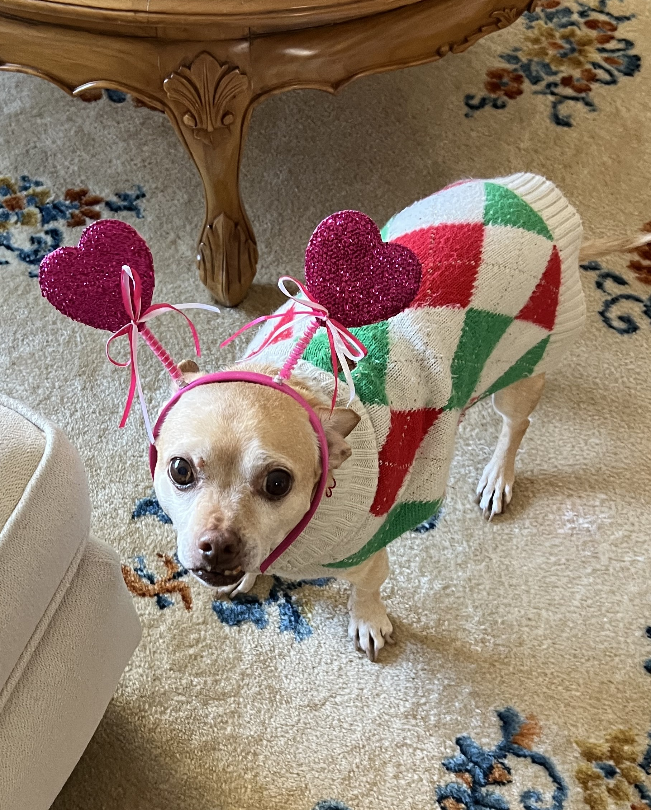
  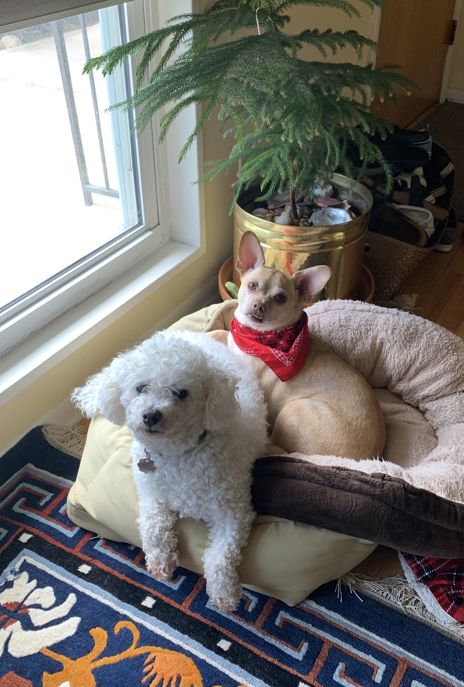

## Foster Dogs in Seattle

Below are some of the puppies and dogs I've fostered through [Resilient Hearts Animal Sanctuary](https://resilientheartsanimalsanctuary.org/) in Seattle.

If you're in Seattle and interested in fostering, I highly recommend getting involved. Fostering allows shelters to make space for unhoused dogs, helping reduce overcrowding and minimizing the risk of euthanasia due to lack of resources.

  <figure>
    <figcaption>Mushu</figcaption>
    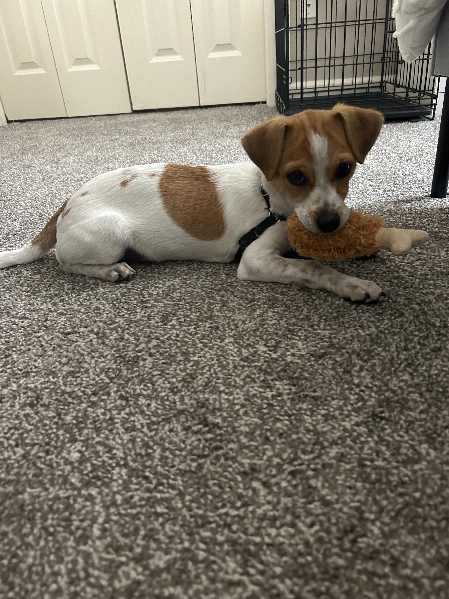
  </figure>
  <figure>
    <figcaption>Roo</figcaption>
    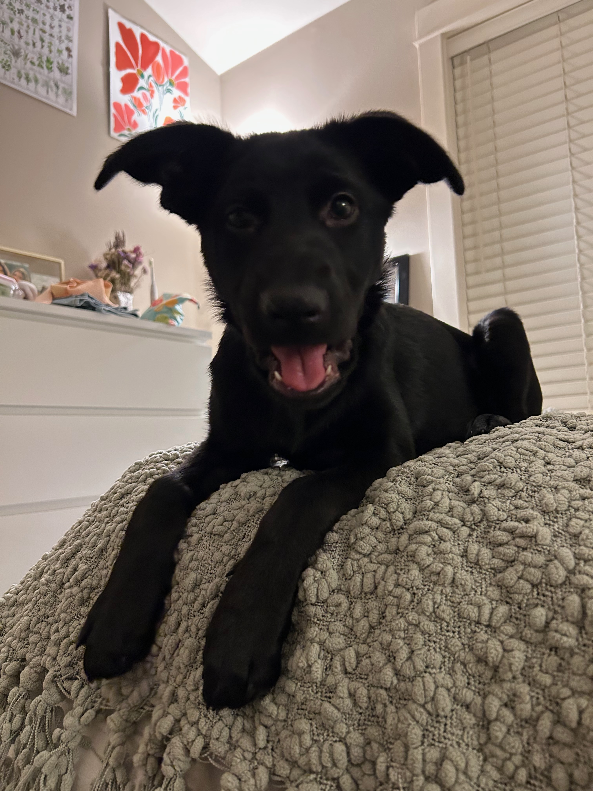
  </figure>
  <figure>
    <figcaption>Yuki</figcaption>
    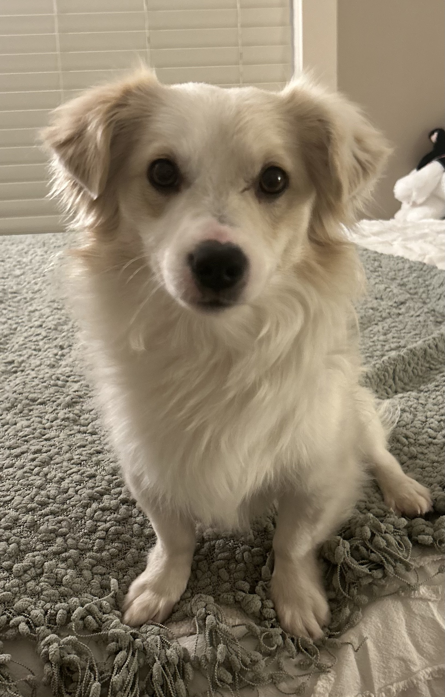
  </figure>
  <figure>
    <figcaption>Pingu</figcaption>
    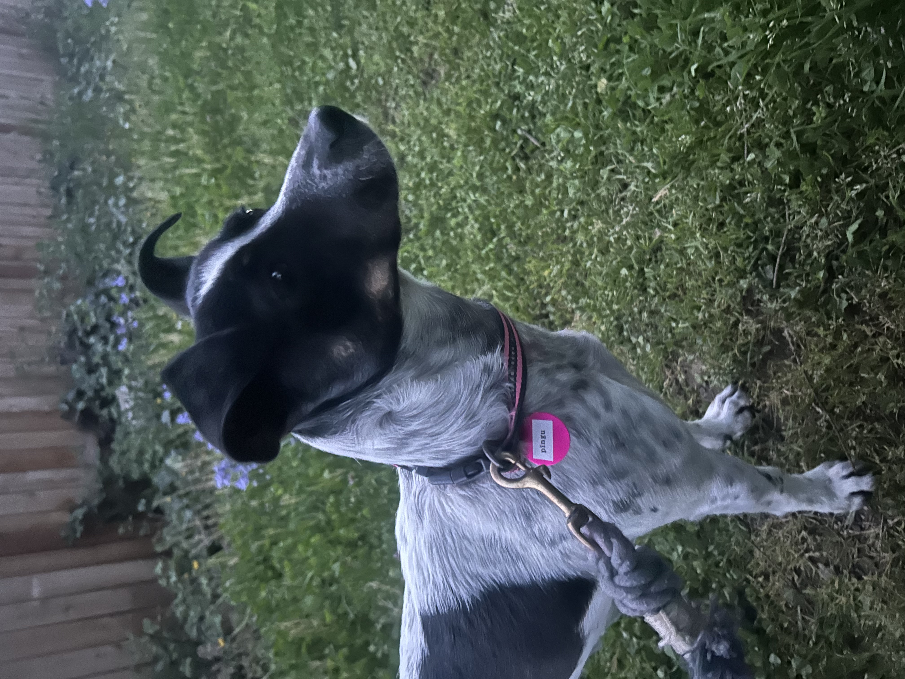
  </figure>
  <figure>
    <figcaption>Charlie Jr.</figcaption>
    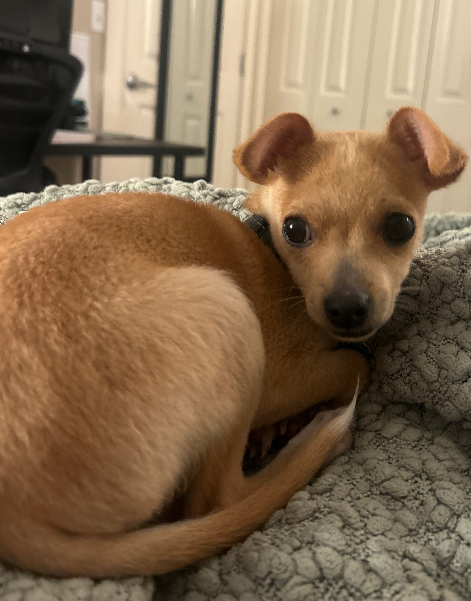
  </figure>
  <figure>
    <figcaption>Mira</figcaption>
    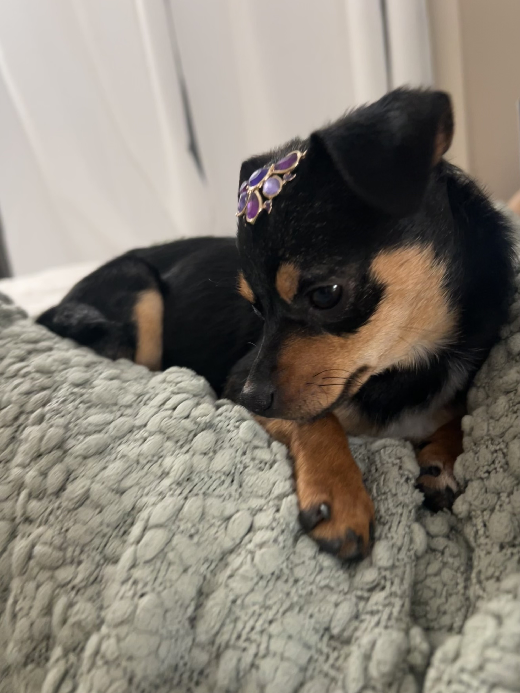
  </figure>

## Go Dawgs!

Featured below is a photo I got with Dubs the II, the mascot of the University of Washington Huskies.

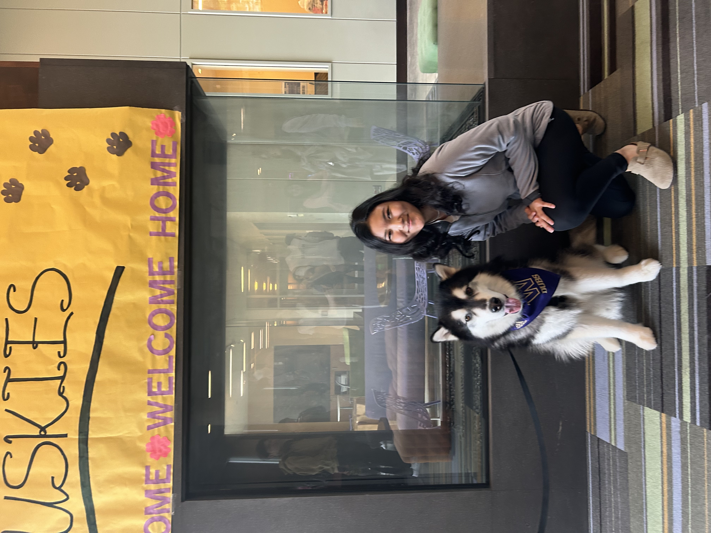

