These dogs have, each in their own way, shaped my sense of care, patience, and presence.

## Cody Sherpa

  Cody was our family's chihuahua mix and my childhood pet, who taught me so much about caring for dogs. 

  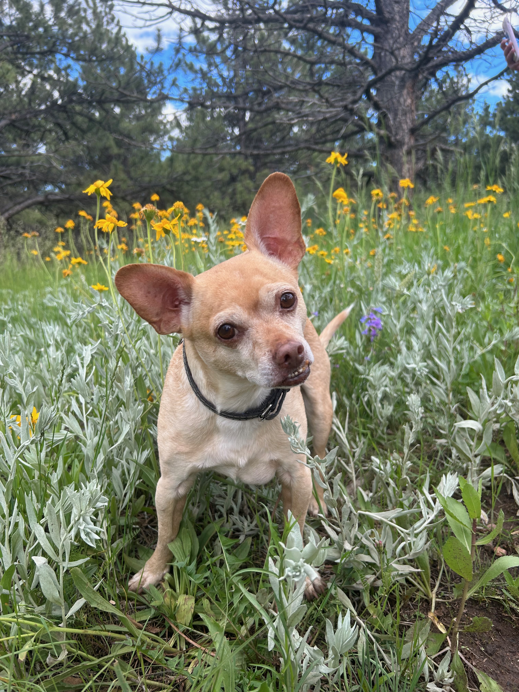
  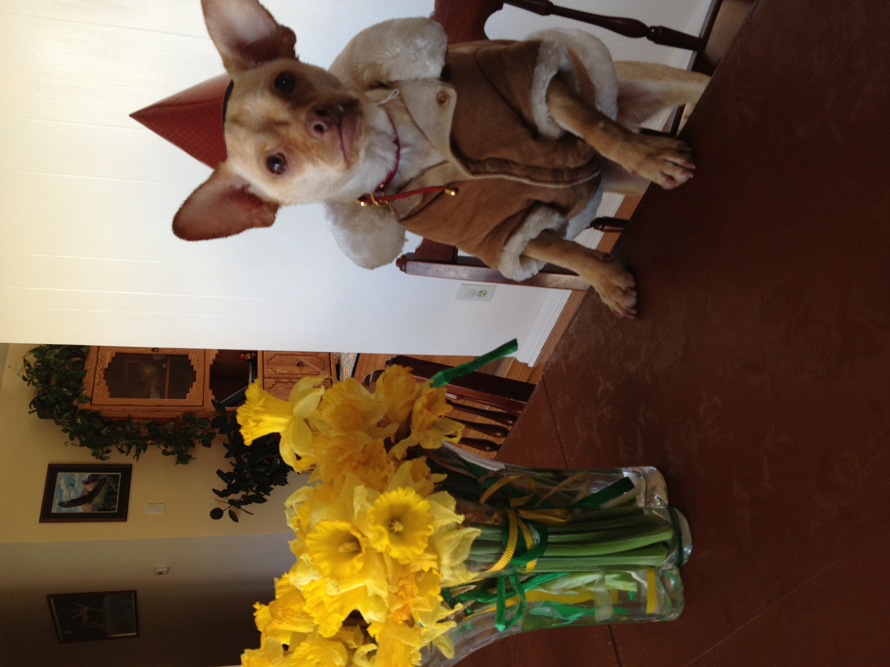
  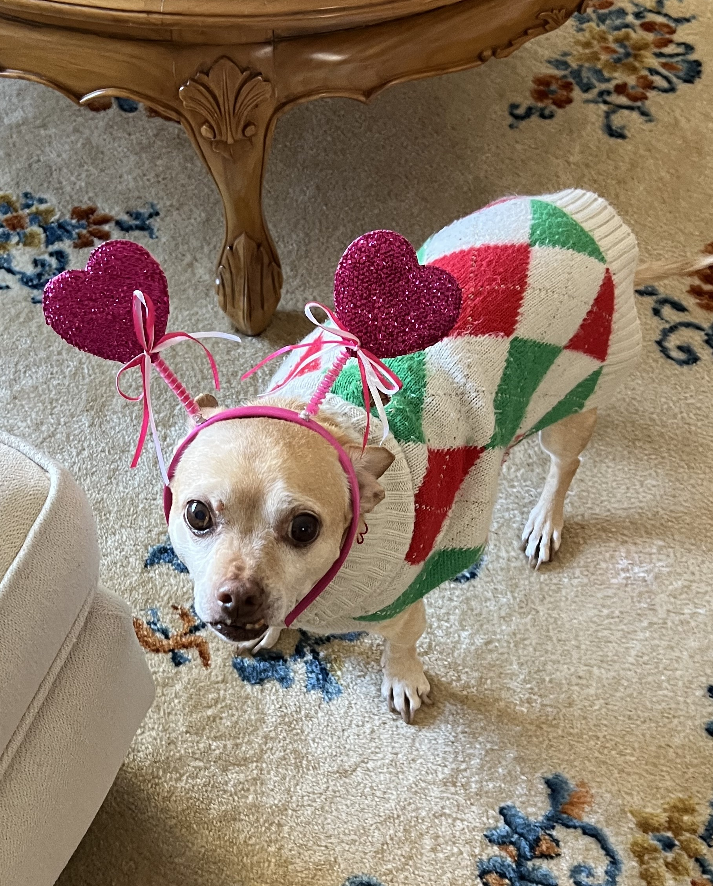
  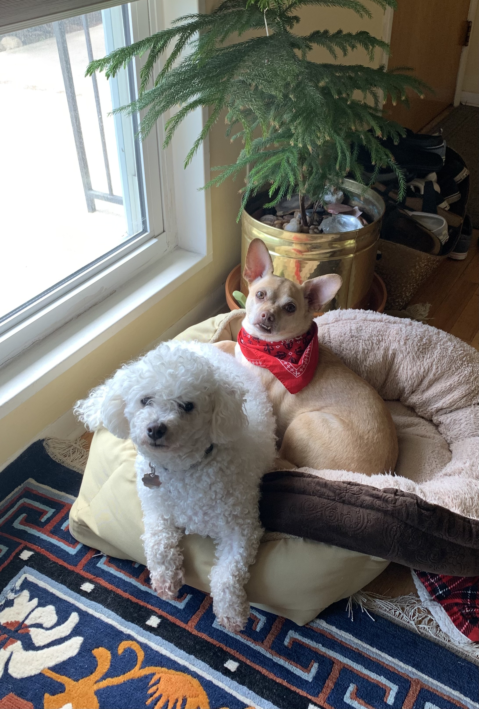

## Foster Dogs in Seattle

I highly recommend getting involved with fostering if you're a dog lover who can handle a little unpredictability in life. 

  <figure>
    <figcaption>Mushu</figcaption>
    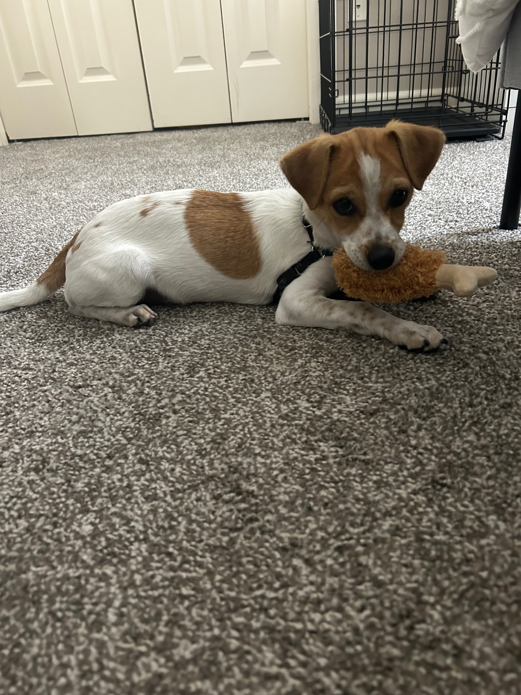
  </figure>
  <figure>
    <figcaption>Roo</figcaption>
    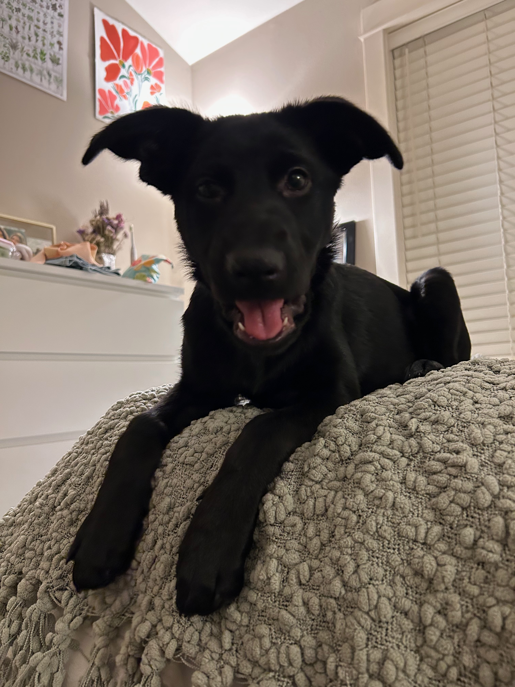
  </figure>
  <figure>
    <figcaption>Yuki</figcaption>
    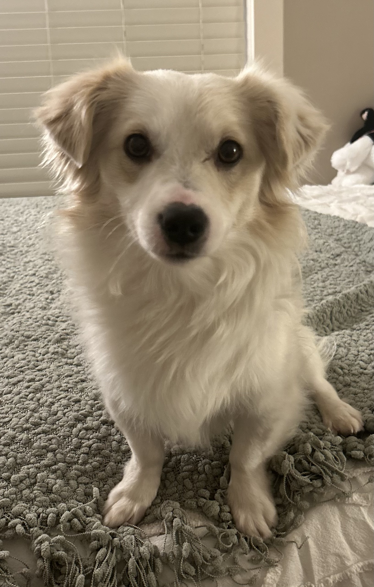
  </figure>
  <figure>
    <figcaption>Pingu</figcaption>
    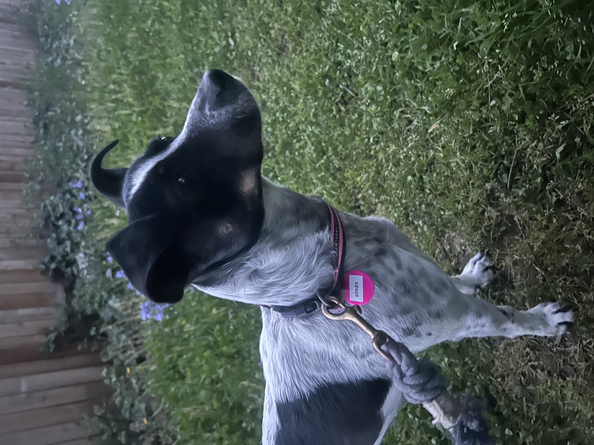
  </figure>
  <figure>
    <figcaption>Charlie Jr.</figcaption>
    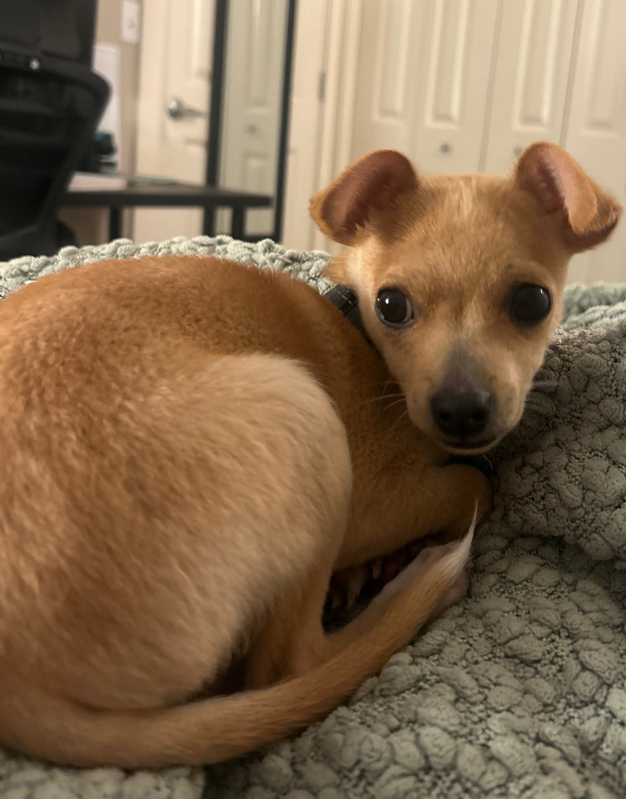
  </figure>
  <figure>
    <figcaption>Mira</figcaption>
    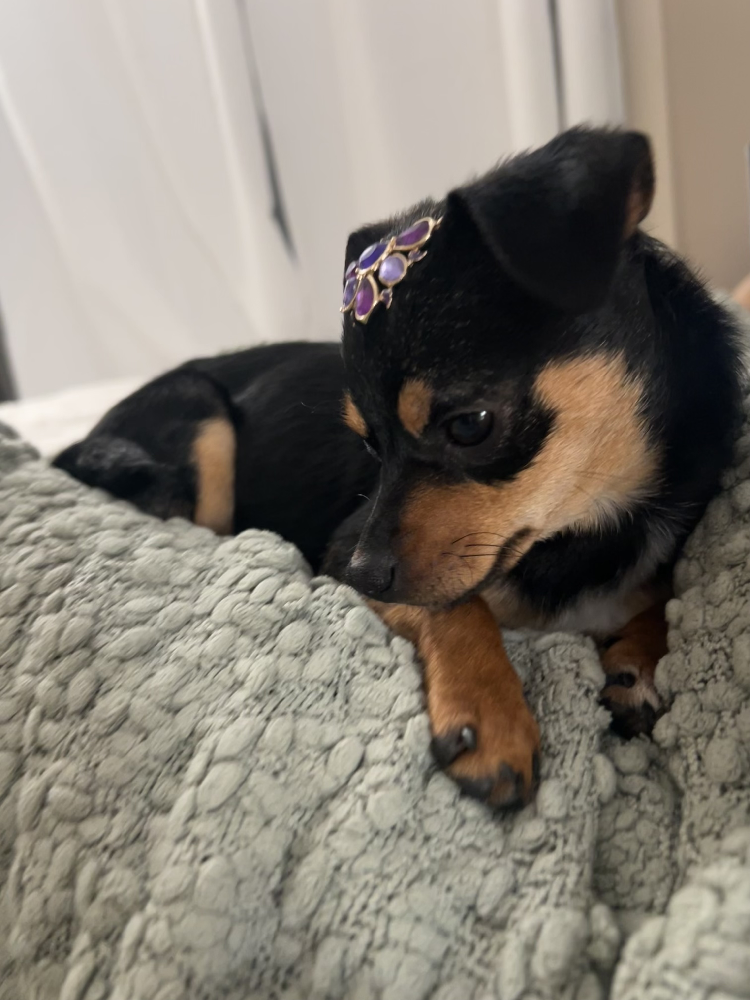
  </figure>
   <figure>
    <figcaption>Nibble</figcaption>
    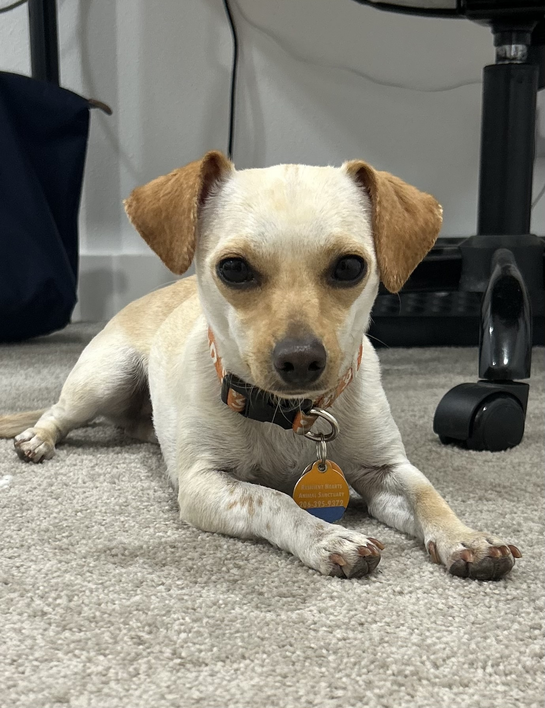
  </figure>
  <figure>
    <figcaption>Pineapple</figcaption>
    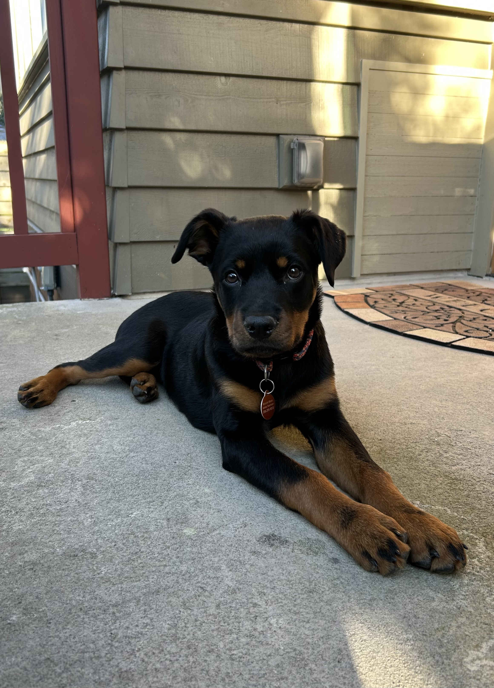
  </figure>
  <figure>
    <figcaption>Toby</figcaption>
    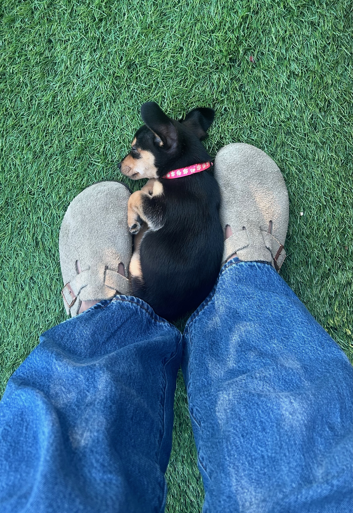
  </figure>

## Go Dawgs!

Featured below is a photo I got with Dubs the II, the mascot of the University of Washington Huskies.

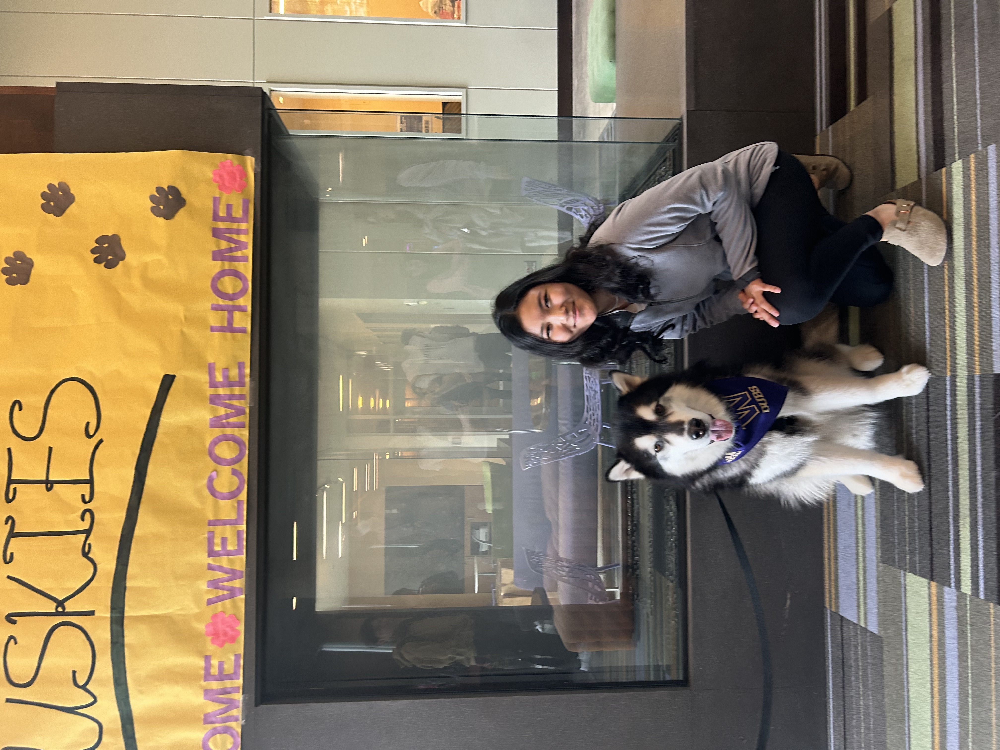

