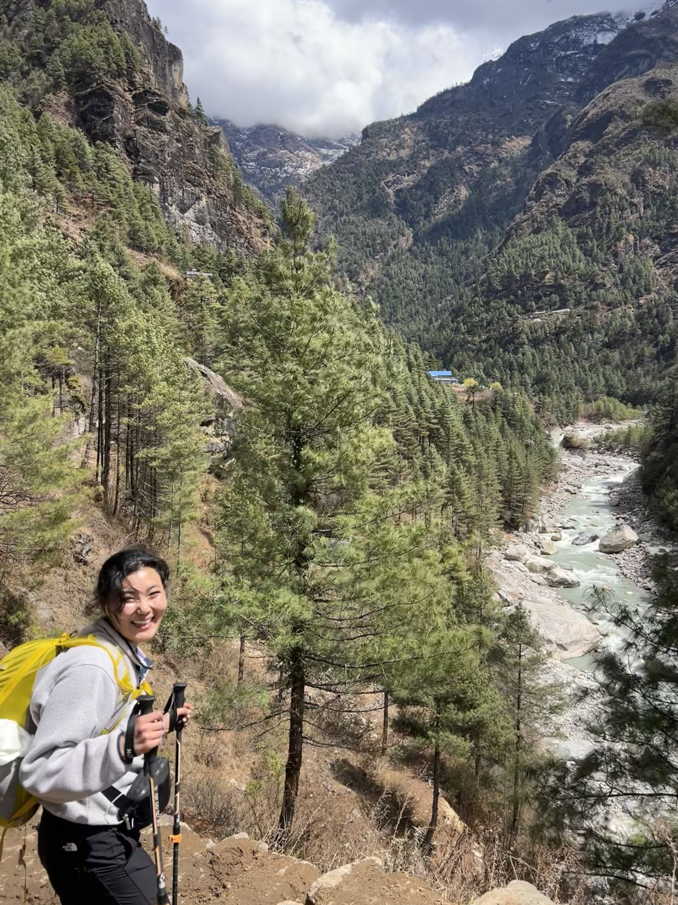
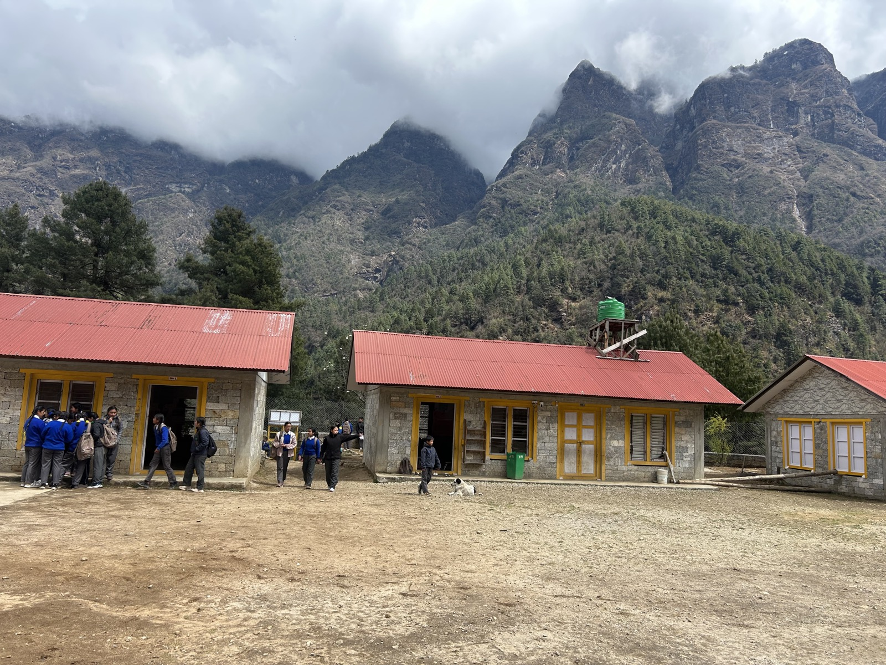
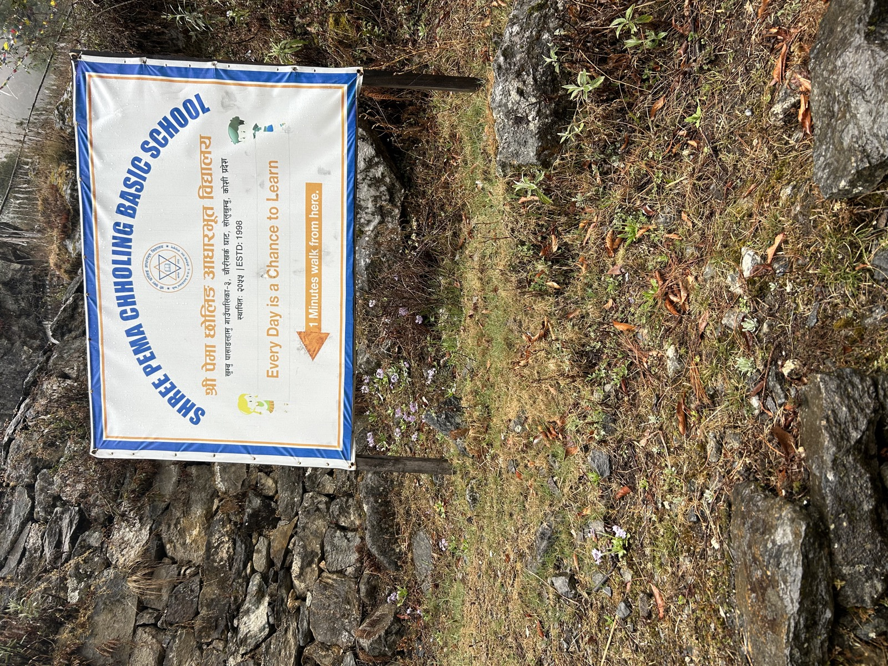
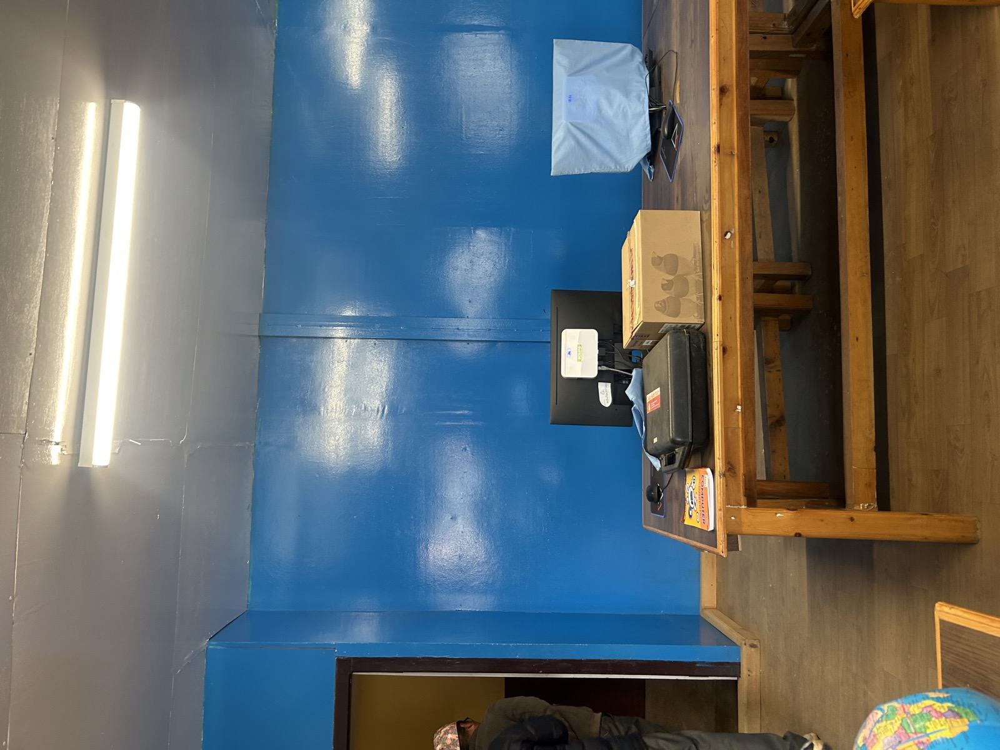
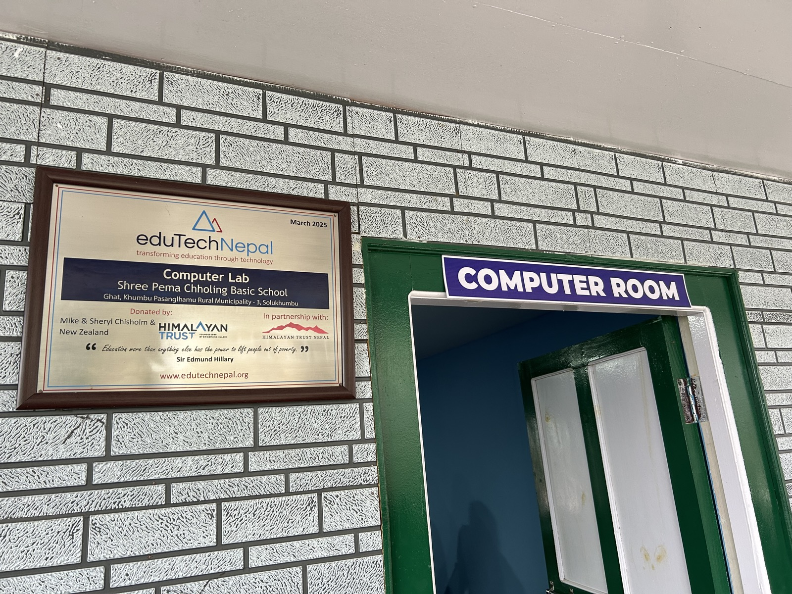
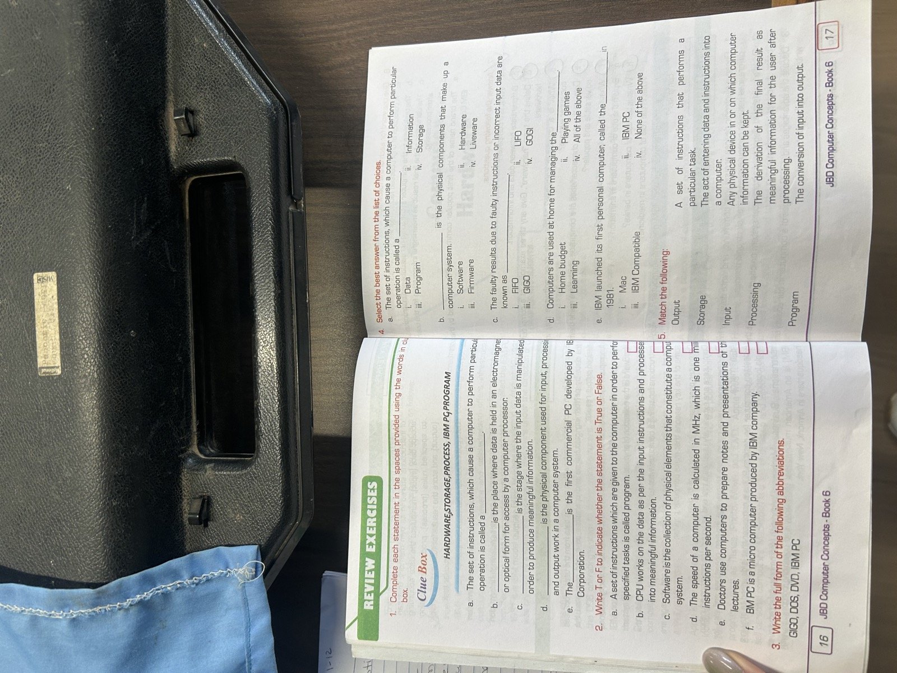
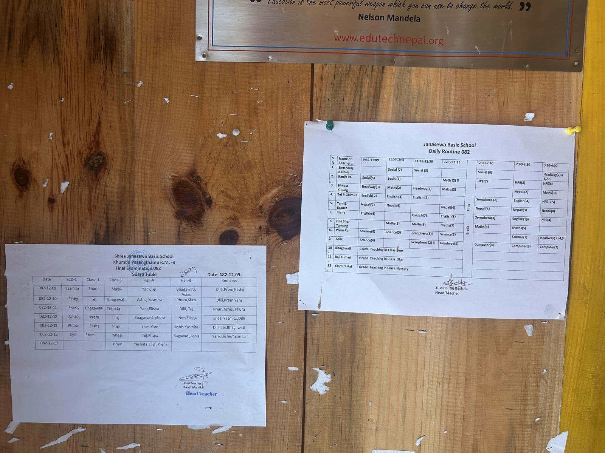
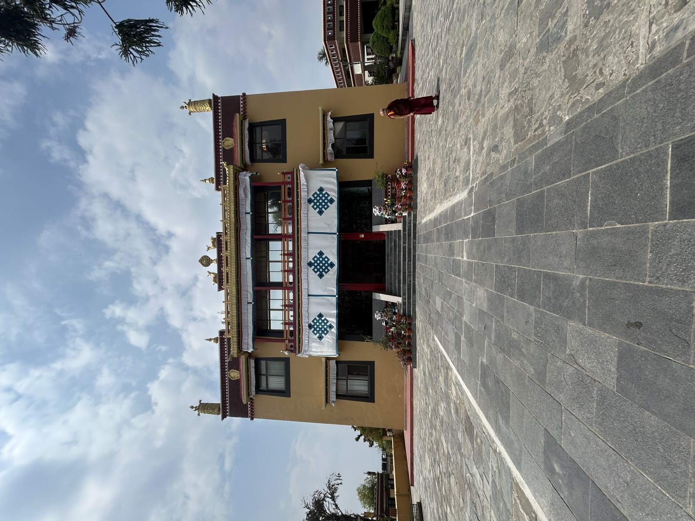

## Solukhumbu, Nepal (March 2026)

In March 2026 I conducted dissertation fieldwork in Solukhumbu District, Nepal, visiting four schools across the Khumbu and Junbesi clusters. The visit informs both Phase I (computer lab effects on student learning) and Phase II (designing an AI teacher-training RCT) of the [SHERPA Project](res.qmd).

The schools I visited were:

- **Shree Yuba Barsha Basic School** (Khumbu Pasanghamu RM-3)
- **Shree Pema Chholing Basic School**
- **Janasewa Basic School**
- **Mahendra Jyoti Secondary School**

At each site I observed computer lab use, interviewed teachers, conducted focus group discussions with students, and documented student work and exam materials. I also catalogued the HTN Quality Education Programme record-keeping system and collected term exam papers across grades 4–7.

::: {layout-ncol=2}

:::

## What the fieldwork sharpened

Across the four sites, the binding constraint on the educational value of the computer labs was rarely the hardware. Schools where teachers had self-taught computer skills produced creative, diverse student output: Student-made PowerPoint presentations, drawings, and short essays. Schools without that human capital used identical labs largely for rote typing.

This finding motivates the next stage of the SHERPA Project: A feasibility pilot in 2026 in partnership with HimalayaAI Labs (HAL) and the Himalayan Trust Nepal, deploying HAL's offline Nepali-language teaching assistant, DeepGyan AI, on teacher workstations in one to two HTN-supported schools to estimate teacher take-up and validate the deployment workflow. 

## Acknowledgments

The fieldwork was conducted in partnership with the Himalayan Trust Network's Quality Education Programme and was approved under UW IRB STUDY00024333. Photographs are shared with the permission of the Himalayan Trust Network and the participating schools. I am grateful to the school principals, teachers, students, and HTN staff in Solukhumbu for their generosity and time.
